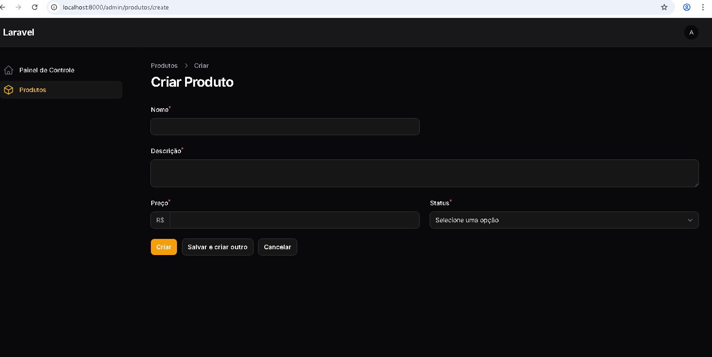
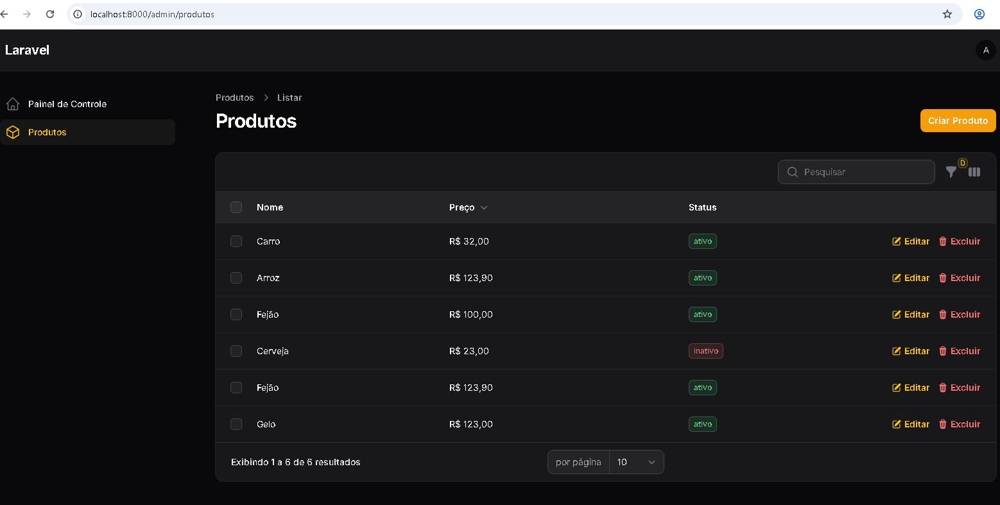
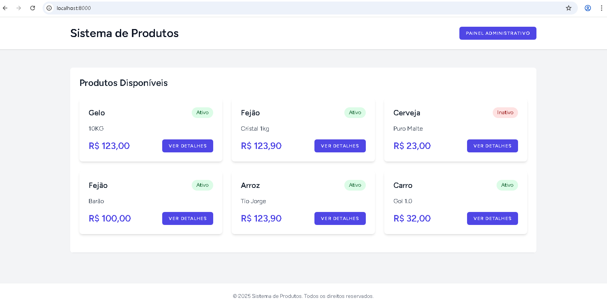

# Requisitos e Instalação do Sistema de gerenciamento de Produtos


## 1. Requisitos do Sistema

### 1.1 Sistema Operacional
- Windows 10/11 (Desenvolvimento)
- Debian 11 ou superior (Produção)

### 1.2 Software Necessário
- PHP 8.3
  - Extensões requeridas:
    - php8.3-fpm
    - php8.3-mysql
    - php8.3-curl
    - php8.3-intl
    - php8.3-gd
    - php8.3-mbstring
    - php8.3-xml
    - php8.3-zip
    - php8.3-bcmath

- MySQL 5.7
  - Usuário: root
  - Senha: 
  - Porta padrão: 3306

- Ferramentas de Desenvolvimento
  - Visual Studio Code
  - HeidiSQL (para gerenciamento do banco de dados)
  - Composer (última versão)
  - Node.js (versão LTS)
  - Git

### 1.3 Configuração do Banco de Dados Existente
1. Abra o HeidiSQL
2. Conecte usando as credenciais:
   - Host: localhost
   - Usuário: root
   - Senha: 
   - Porta: 3306
3 - Importe o Banco de dados se necessário
  - banco_suprimentos.sql

4. Execute os seguintes comandos SQL:
```sql
CREATE DATABASE IF NOT EXISTS banco_suprimentos;
USE banco_suprimentos;
GRANT ALL PRIVILEGES ON banco_suprimentos.* TO 'root'@'localhost';
FLUSH PRIVILEGES;
```

### 1.4 Inicialização do Projeto do GitHub

1. Clone o repositório:
```bash
git clone https://github.com/Adeilsonnm/suprimentos.git
cd suprimentos
```

2. Instale as dependências do PHP:
```bash
composer install
```

3. Instale as dependências do Node.js:
```bash
npm install
```

4. Configure o ambiente:
```bash
cp .env.example .env
php artisan key:generate
```

5. Configure o banco de dados:
   - Abra o HeidiSQL
   - Conecte com as credenciais mencionadas (root/123456)
   - Crie o banco de dados:
   ```sql
   CREATE DATABASE IF NOT EXISTS banco_suprimentos;
   ```
   - Importe o banco de dados base:
   ```bash
   # Via linha de comando
   mysql -u root -p123456 banco_suprimentos < docs/banco_suprimentos.sql

   # Ou via HeidiSQL:
   # 1. Clique com botão direito no banco 'banco_suprimentos'
   # 2. Selecione "Carregar arquivo SQL"
   # 3. Navegue até a pasta docs/banco_suprimentos.sql
   # 4. Execute a importação
   ```

6. Configure o arquivo .env:
```env
DB_CONNECTION=mysql
DB_HOST=127.0.0.1
DB_PORT=3306
DB_DATABASE=banco_suprimentos
DB_USERNAME=root
DB_PASSWORD=
```

7. Gere os assets:
```bash
npm run build
```

8. Crie o link simbólico do storage:
```bash
php artisan storage:link
```

9. Limpe os caches:
```bash
php artisan config:clear
php artisan cache:clear
php artisan view:clear
```

10. Inicie o servidor de desenvolvimento:
```bash
php artisan serve
```

11. Acesse o sistema:
- Frontend: http://localhost:8000
- Painel Admin: http://localhost:8000/admin
- email : admin@admin.brasil
- senha : 123456


Em caso de problemas:
1. Verifique as permissões das pastas:
```bash
chmod -R 777 storage bootstrap/cache
```

2. Verifique se todos os serviços estão rodando:
```bash
# Verificar status do MySQL
service mysql status

# Verificar versão do PHP
php -v
```

3. Logs para verificação:
- Laravel: `storage/logs/laravel.log`
- MySQL: `/var/log/mysql/error.log`

## 2. Processo de Instalação

### 2.1 Preparação do Ambiente
```bash
# Instalar Composer
php -r "copy('https://getcomposer.org/installer', 'composer-setup.php');"
php composer-setup.php --install-dir=/usr/local/bin --filename=composer

# Instalar Node.js e NPM (Windows)
# Baixe e instale do site oficial: https://nodejs.org/
```

### 2.2 Criação do Projeto
```bash
# Criar novo projeto Laravel
composer create-project laravel/laravel:^11.x suprimentos

# Entrar no diretório do projeto
cd suprimentos

# Instalar Filament
composer require filament/filament:^3.3 -W

# Copiar arquivo de ambiente
copy .env.example .env   # Windows
# ou
cp .env.example .env    # Linux

# Gerar chave da aplicação
php artisan key:generate

# Instalar Filament
php artisan filament:install --panels

# Criar usuário administrativo
php artisan make:filament-user
```

### 2.3 Configuração do Ambiente

1. Editar o arquivo `.env`:
```env
APP_NAME="Sistema de Suprimentos"
APP_ENV=local
APP_DEBUG=true
APP_URL=http://localhost:8000

DB_CONNECTION=mysql
DB_HOST=127.0.0.1
DB_PORT=3306
DB_DATABASE=banco_suprimentos
DB_USERNAME=root
DB_PASSWORD=
```

2. Instalar dependências frontend:
```bash
npm install
npm run dev
```

### 2.4 Configuração do Visual Studio Code

Extensões recomendadas:
- Laravel Extension Pack
- PHP Intelephense
- Tailwind CSS IntelliSense
- Laravel Blade formatter
- PHP Namespace Resolver

### 2.5 Verificação da Instalação

1. Iniciar o servidor de desenvolvimento:
```bash
php artisan serve
npm run dev ###(iniciar VITE)
```

2. Acessar o sistema:
- Frontend: http://localhost:8000
- Admin: http://localhost:8000/admin

### 2.1 Acesso de testes
- email : admin@admin.brasil
- senha : 123456

### 2.6 Comandos Úteis

```bash
# Limpar cache
php artisan cache:clear
php artisan config:clear
php artisan view:clear

# Verificar rotas
php artisan route:list

# Executar migrações
php artisan migrate

# Criar link simbólico para storage
php artisan storage:link
```

## 3. Solução de Problemas

### 3.1 Problemas Comuns

1. Erro de permissão:
```bash
chmod -R 777 storage bootstrap/cache
```

2. Erro de dependências:
```bash
composer install --ignore-platform-reqs
```

3. Erro de banco de dados:
```bash
php artisan config:clear
php artisan migrate:fresh
```

## 5. Estrutura do Projeto
### O projeto está organizado nos seguintes diretórios principais:

- app/Enums/ - Contém as definições de enums
- app/DataTransferObjects/ - Contém os DTOs
- app/Models/ - Contém os modelos
- app/Filament/ - Contém os recursos do Filament
- app/Livewire/ - Contém os componentes Livewire
- app/Observers/ - Contém os observers
- resources/views/ - Contém as views

## 4. Alguns Recursos

### Criar Produtos


### Listar Produtos


### Listar produtos na tela inicial



